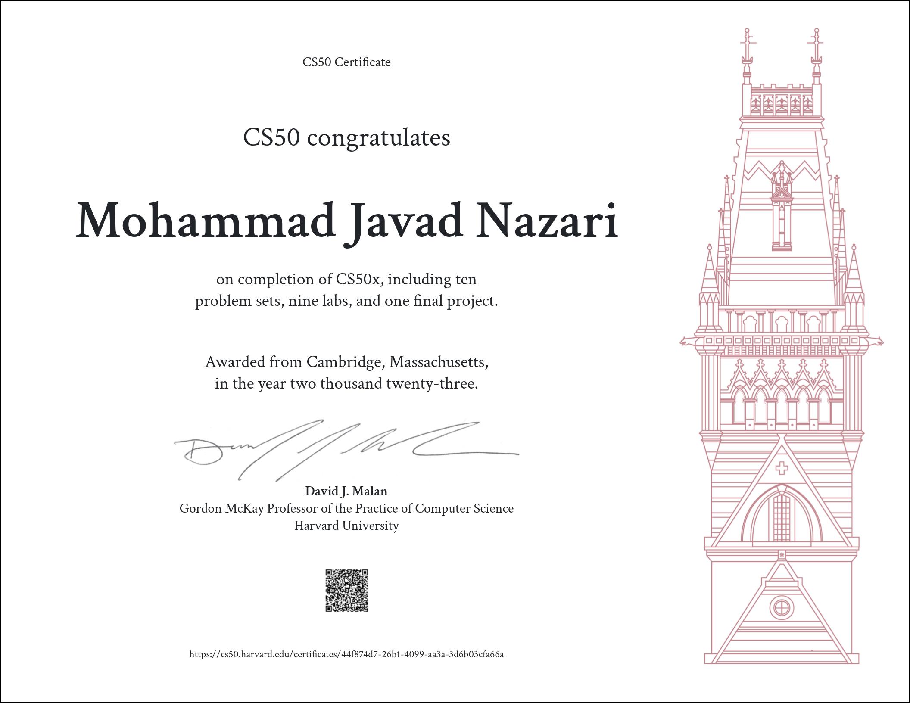

# CS50X 2023 --> Introduction to Computer Science  

### These are my solutions for CS50X Introduction to Computer Science 2023.
### Final Project : [Blog + New Admin Panel + Django](#)

## Table of Contents

---

### :arrow_forward: **Notes**

 

- **[Notes](Notes)** - _contains notes I took from various sources, mostly from each week's notes section._

---

### :arrow_forward: **Week 1 - C**

 

- **[L-1 - Population Growth](Week%201/Lab1/Population/Population.c)** - _determine how long it takes for a population to reach a particular size._

- **[PS-1 - Mario Less](Week%201/ProblemSet1/MarioLess/Mario.c)** - _create a right-aligned pyramid of blocks._

- **[PS-1 - Mario More](Week%201/ProblemSet1/MarioMore/Mario.c)** - _create an adjacent pyramid of blocks._

- **[PS-1 - Cash](Week%201/ProblemSet1/Cash/Cash.c)** - _minimize the number of coins given to a customer when making a change using greedy algorithms._

---

### :arrow_forward: **Week 2 - Arrays**

 

- **[L-2 Scrabble](Week%202/Lab2/Scrabble/Scrabble.c)** - _determine which of two scrabble words is worth more._

- **[PS-2 Caesar](Week%202/ProblemSet2/Caesar/Caesar.c)** - _program that encrypts messages using Caesar's cipher._

- **[PS-2 Readability](Week%202/ProblemSet2/Readability/Readability.c)** - _computes the approximate grade level needed to comprehend some text._

---

### :arrow_forward: **Week 3 - Algorithms**

 

- **[L-3 Sort](Week%203/Lab3/Sort/Answers.txt)** - _analyze three sorting programs to determine which algorithms they use._

- **[PS-3 Plurality](Week%203/ProblemSet3/Plurality/Plurality.c)** - _program that runs a plurality election._

- **[PS-3 Runoff](Week%203/ProblemSet3/Runoff/Runoff.c)** - _program that runs a runoff election._

---

### :arrow_forward: **Week 4 - Memory**

 

- **[L-4 Volume](Week%204/Lab4/Volume/Volume.c)** - _modify the volume of an audio file._

- **[PS-4 Filter Less](Week%204/ProblemSet4/FilterLess/Filter.c)** - _program that applies filters to BMPs._

- **[PS-4 Recover](Week%204/ProblemSet4/Recover/Recover.c)** - _program that recovers JPEGs from a forensic image._

---

### :arrow_forward: **Week 5 - Data Structures**

 

- **[L-5 Inheritance](Week%205/Lab5/Inheritance/Inheritance.c)** - _simulates the inheritance of blood types for each member of a family._

- **[PS-5 Speller](Week%205/ProblemSet5/Speller/Speller.c)** - _program that spell-checks a file using a hash table._

---

### :arrow_forward: **Week 6 - Python**

 

- **[L-6 World Cup](Week%206/Lab6/WorldCup/Tournament.py)** - _program to run simulations of the FIFA World Cup._

- **[PS-6 Mario Less](Week%206/ProblemSet6/SentimentalMarioLess/Mario.py)** - _create a right-aligned pyramid of blocks._

- **[PS-6 Mario More](Week%206/ProblemSet6/SentimentalMarioMore/Mario.py)** - _create an adjacent pyramid of blocks._

- **[PS-6 Cash](Week%206/ProblemSet6/SentimentalCash/Cash.py)** - _minimize the number of coins given to a customer when making a change using greedy algorithms._

- **[PS-6 Credit](Week%206/ProblemSet6/SentimentalCredit/Credit.py)** - _program that determines whether a provided credit card number is valid according to Luhn's algorithm._

- **[PS-6 Readability](Week%206/ProblemSet6/SentimentalReadability/Readability.py)** - _computes the approximate grade level needed to comprehend some text._

- **[PS-6 DNA](Week%206/ProblemSet6/DNA/Dna.py)** -  _program that identifies a person based on their DNA._

---

### :arrow_forward: **Week 7 - SQL**

 

- **[L-7 Songs](Week%207/Lab7/Songs/)** - _SQL queries that answer questions about a database of songs._

- **[PS-7 Movies](Week%207/ProblemSet7/Movies/)** - _SQL queries that answer questions about a database of movies._

- **[PS-8 Fiftyville](Week%207/ProblemSet7/Fiftyville/Log.sql)** - _write SQL queries to solve a mystery._

---

### :arrow_forward: **Week 8 - HTML, CSS, JavaScript**

 

   

- **[L-8 Trivia](Week%208/Lab8/Trivia/Index.html)** - _simple webpage that lets users answer trivia questions._

- **[PS-8 Homepage](Week%208/ProblemSet8/Homepage/Index.html)** - _simple web application with multiple pages._

---

### :arrow_forward: **Week 9 - Flask**

 

      

- **[L-9 Birthdays](Week%209/Lab9/Birthdays/App.py)** - _web application that keeps track of birthdays._

- **[PS-9 Finance](Week%209/ProblemSet9/Finance/App.py)** - _website via which users can 'buy' and 'sell' stocks._

---

### :arrow_forward: **Scratch**

 

- **[Whack-a-Mouse](#)** - _a simple Scratch game which is a combination of Space Invaders and Whack-a-Mole._

---

## **warning & Disclaimer** :
The following codes are for educational purpose only and not intended to be used / submitted as your own solutions.
## Cheating violates the [Academic Honesty](https://cs50.harvard.edu/python/2023/honesty/) of the course, not to mention it's totally pointless if you actually want to learn programming.

## **Concerns**
I like to share my progress which also helps motivate me to finish the course faster. Although if any directors  of the course want me to take this down I will gladly do so, just shoot me a message via <mohammad.nazari@live.com>

## :books: **Credits**

First of all, a huge thank you to Prof. David J. Malan and the rest of the CS50 staff for giving us this free learning opportunity. I thoroughly recommend the CS50 course for anyone who wants to get into or improve their skills in the Computer Science field.

 
